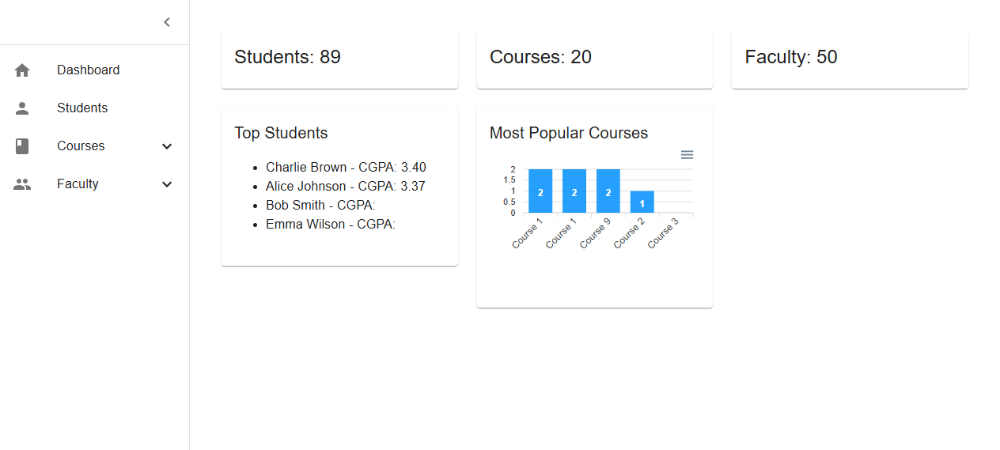
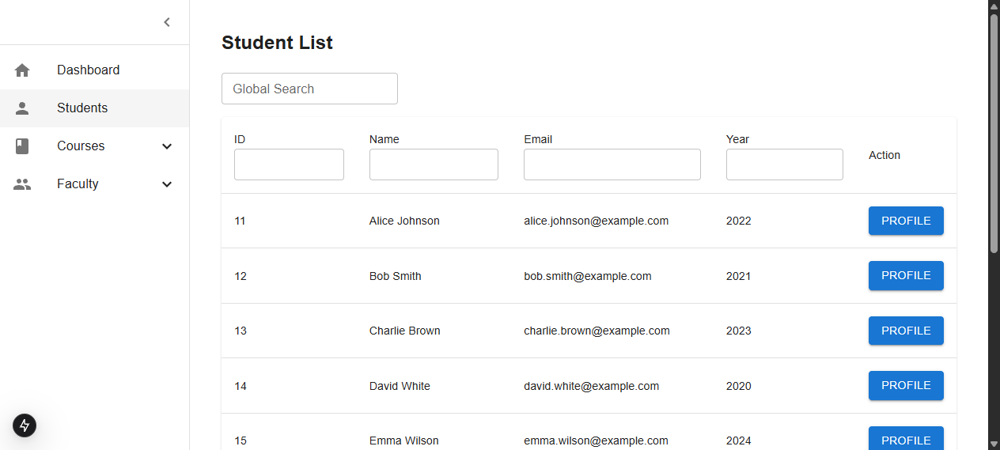
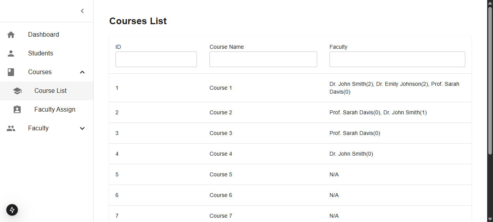
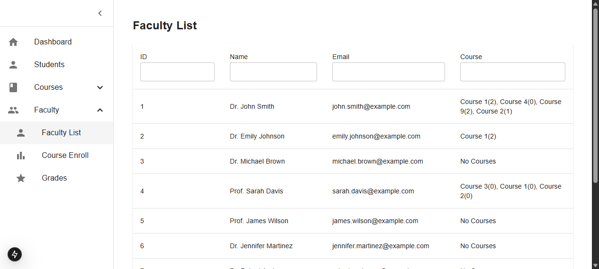
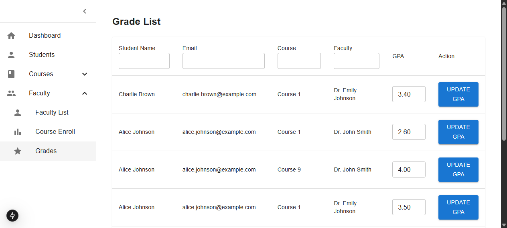

# Academic Management Dashboard

A full-stack academic management dashboard built with **Next.js 15 (App Router)** and **Material UI**, backed by **MySQL** through **Sequelize**. It provides an administrative interface for managing students, courses, faculty, enrollments, and grades.



---

## Table of Contents

- [Features](#features)
- [Screenshots](#screenshots)
- [Tech Stack](#tech-stack)
- [Prerequisites](#prerequisites)
- [Getting Started](#getting-started)
  - [1. Database setup](#1-database-setup)
  - [2. Environment variables](#2-environment-variables)
  - [3. Install dependencies](#3-install-dependencies)
  - [4. Run the application](#4-run-the-application)
- [Environment Variables Reference](#environment-variables-reference)
- [Available Scripts](#available-scripts)
- [Project Structure](#project-structure)
- [API Overview](#api-overview)
- [Loading & Error Handling](#loading--error-handling)
- [Frequently Asked Questions](#frequently-asked-questions)
- [Contributing](#contributing)
- [License](#license)

---

## Features

- **Dashboard** — summary cards (students, courses, faculty counts) plus a "Top Students" leaderboard and a "Most Popular Courses" enrollment chart.
- **Students** — searchable, filterable, and sortable student list with an individual student profile page.
- **Courses** — course list showing assigned faculty and enrollment counts per faculty member.
- **Faculty** — faculty list with the courses each member teaches.
- **Course / Faculty Assignment** — assign faculty members to courses and students to courses.
- **Grades** — grade list with inline GPA updates per student/course/faculty combination.
- **Responsive UI** — Material UI layout with a collapsible sidebar built for desktop and mobile.
- **Robust data fetching** — parallel API requests with graceful failure handling, skeleton loading states, and an error boundary with retry.

## Screenshots

| Page | Preview |
| --- | --- |
| Dashboard |  |
| Students |  |
| Courses |  |
| Faculty |  |
| Grades |  |

## Tech Stack

| Layer | Technology |
| --- | --- |
| Framework | [Next.js](https://nextjs.org/) 15 (App Router, React 19) |
| UI Library | [Material UI](https://mui.com/) 6 + icons |
| Charts | [ApexCharts](https://apexcharts.com/) (client-side, SSR-safe wrapper) |
| ORM | [Sequelize](https://sequelize.org/) 6 |
| Database | [MySQL](https://www.mysql.com/) 8 |
| Driver | [mysql2](https://www.npmjs.com/package/mysql2) |
| Alerts | [SweetAlert2](https://sweetalert2.github.io/) |

## Prerequisites

- [Node.js](https://nodejs.org/) 18.18+ (Next.js 15 requirement) and npm
- [MySQL](https://www.mysql.com/) 8.x running locally (or a reachable MySQL server)

## Getting Started

### 1. Database setup

Create the database and load the bundled dump file:

```bash
# 1. Create the database
mysql -u root -p
> CREATE DATABASE academic_management_dashboard;

# 2. Import the schema and seed data (from the project root)
mysql -u root -p academic_management_dashboard < db/academic_management_dashboard.dump
```

### 2. Environment variables

Copy the example environment file and adjust the values to match your setup:

```bash
cp .env.example .env.local
```

At minimum, `NEXT_PUBLIC_API_URL` must point at the running application (default `http://localhost:3000`). See the [reference table](#environment-variables-reference) below.

### 3. Install dependencies

```bash
npm install
```

### 4. Run the application

```bash
npm run dev
```

Open [http://localhost:3000](http://localhost:3000) in your browser. The dashboard loads live data from the API routes in `src/app/api/`.

## Environment Variables Reference

Configuration is provided through a `.env.local` file in the project root. All variables are optional — the app falls back to safe defaults when they are absent.

| Variable | Description | Default |
| --- | --- | --- |
| `NEXT_PUBLIC_API_URL` | Base URL of the application used by server-side fetches and API calls. | `http://localhost:3000` |
| `DB_HOST` | MySQL host address. | `127.0.0.1` |
| `DB_PORT` | MySQL port. | `3306` |
| `DB_USER` | MySQL username. | `root` |
| `DB_PASSWORD` | MySQL password. | *(empty)* |
| `DB_NAME` | MySQL database name. | `academic_management_dashboard` |

> **Security note:** never commit real credentials. Keep secrets in `.env.local` (already recommended) and rotate anything that gets committed accidentally.

## Available Scripts

| Script | Description |
| --- | --- |
| `npm run dev` | Start the development server on `http://localhost:3000`. |
| `npm run build` | Create a production build. |
| `npm run start` | Serve the production build. |
| `npm run lint` | Run the ESLint checks. |

## Project Structure

```
├── db/
│   └── academic_management_dashboard.dump   # MySQL schema + seed data
├── docs/
│   └── screenshots/                        # Screenshots used in this README
├── public/                                 # Static assets
└── src/
    ├── app/
    │   ├── api/                             # Route handlers (Next.js API endpoints)
    │   │   ├── course-assign/
    │   │   ├── course-enrollment/
    │   │   ├── courses/
    │   │   ├── faculty/
    │   │   ├── faculty-assign/
    │   │   ├── grades/
    │   │   ├── popular-courses/
    │   │   ├── stats/
    │   │   ├── students/
    │   │   └── top-students/
    │   ├── components/                      # UI components (Sidebar, table wrappers, charts)
    │   │   ├── BarChart.js                  # ApexCharts bar chart (client-only rendering)
    │   │   ├── DynamicBarChart.js           # SSR-safe wrapper (dynamic + ssr: false)
    │   │   └── Sidebar.js
    │   ├── student-profile/[studentId]/     # Individual student profile page
    │   ├── course-assign/                   # Assign faculty to courses
    │   ├── courses/                         # Course list
    │   ├── faculty/                         # Faculty list
    │   ├── faculty-assign/                  # Enroll students into courses
    │   ├── grades/                          # Grade list + GPA updates
    │   ├── students/                        # Student list
    │   ├── error.js                         # App-wide error boundary (retry button)
    │   ├── loading.js                       # Loading skeleton during navigation
    │   ├── layout.js                        # Root layout + sidebar shell
    │   └── page.js                          # Dashboard (server-rendered, dynamic)
    └── lib/
        ├── config/
        │   └── sequelize.js                 # Sequelize instance (env-driven)
        └── models/                          # Sequelize models + associations barrel
            ├── Course.js
            ├── Faculty.js
            ├── FacultyCourse.js
            ├── Student.js
            ├── StudentEnrollment.js
            └── associations.js              # Import target for API routes
```

Business logic (models, DB configuration) lives in `src/lib/`; the `src/app/` directory contains only routing concerns, matching the Next.js convention.

## API Overview

| Endpoint | Method | Description |
| --- | --- | --- |
| `/api/stats` | GET | Student / course / faculty counts for the dashboard headline cards. |
| `/api/top-students` | GET | Students ordered by CGPA (top performers). |
| `/api/popular-courses` | GET | Courses sorted by total enrollment, limited to 5. |
| `/api/course-enrollment` | GET | Monthly enrollment counts for the chart. |
| `/api/students` | GET | Paginated student list. |
| `/api/courses` | GET | Course list with assigned faculty. |
| `/api/faculty` | GET | Faculty list with linked courses. |
| `/api/grades` | GET | Enrollment grade rows. |
| `/api/students/details` | GET | Per-student profile data. |
| `/api/course-assign`, `/api/faculty-assign` | GET/POST | Assignment operations. |

## Loading & Error Handling

- **`loading.js`** — Material UI skeletons keep the interface responsive while Next.js streams dynamic content.
- **`error.js`** — a client-side error boundary catches render failures, shows the error message, and offers a **Try again** button wired to recovery.
- **Dashboard fetches** — every API call is wrapped in a shared helper with `try/catch` and `no-store`; the dashboard degrades section-by-section instead of crashing, and shows a single fallback alert only when *all* data sources fail.

## Frequently Asked Questions

**Q: Why is the dashboard page marked `force-dynamic`?**
A: The page reads live data on every request (`cache: "no-store"`), so it opts out of static pre-rendering to always show fresh numbers.

**Q: The chart appears only after a brief empty space.**
A: The chart library (`apexcharts`) uses browser APIs at import time, so it is intentionally excluded from server-side rendering via an SSR-safe dynamic wrapper. The delay is the client-side hydration of that component only.

**Q: Do I need to configure the `@/*` alias to run the app?**
A: No. The project is pure JavaScript; the alias is declared in `jsconfig.json` for editor tooling, while API routes use depth-correct relative imports so no build-time configuration is required.

## Contributing

1. Fork the repository.
2. Create a feature branch (`git checkout -b feat/your-change`).
3. Commit your changes with a clear, conventional message.
4. Push to your fork and open a pull request against `main`.
5. Add or update tests and documentation where relevant, and verify with `npm run build`.

## License

Distributed under the [MIT License](LICENSE).